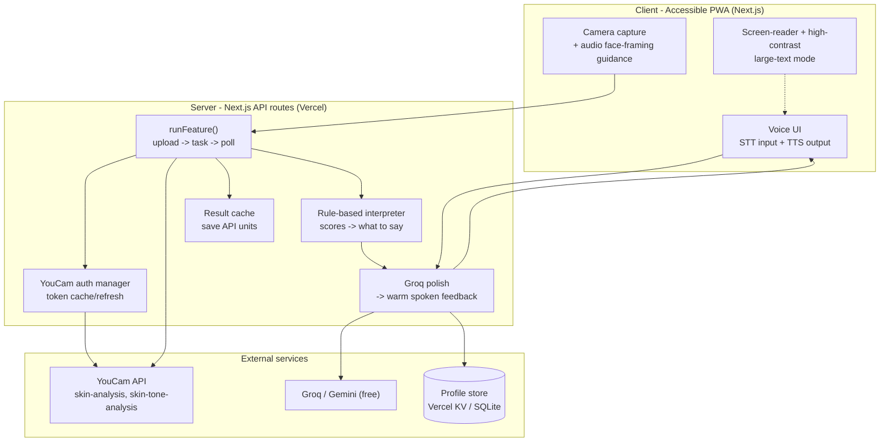
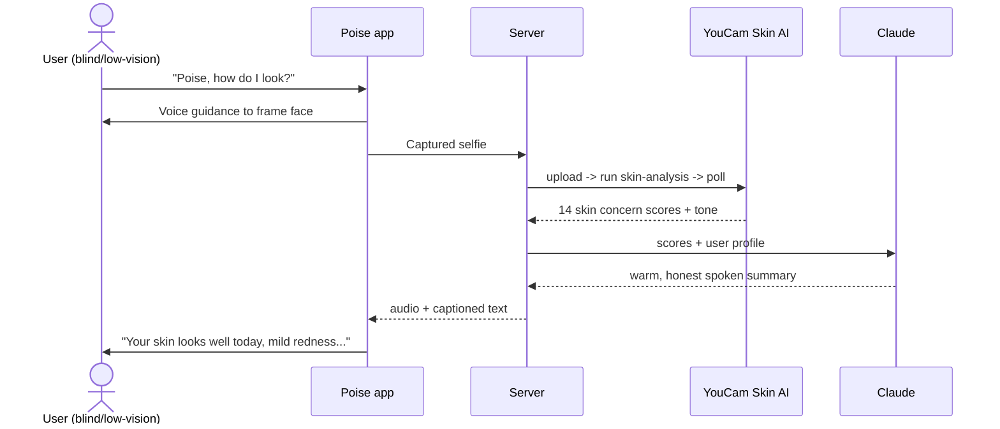

# Poise — Project Plan & Living Memory

> **Purpose of this file:** single source of truth for the Poise build. It captures what we're building, why, the decisions behind it, and exactly where we left off. Update it every session. If a session is interrupted, start here.
>
> **Last updated:** 2026-07-24 · **Status (POST-PIVOT):** Agentic combined app working — 3 YouCam APIs (skin-analysis, facial-color-tones, cloth-v3), voice-first multi-screen agent (skin / colour season / apparel try-on + wardrobe / "get me ready" orchestration / history), human male/female voice, natural-language voice nav. Phases A–D done + verified. **Recent (2026-07-24):** vision moved off Gemini → OpenRouter free vision; described-garment try-on renders any colour via multiply-recolour of a verified base (fixes mislabelled catalog photos — verified olive & black render correctly); **flagship skin-state colour modulation** (today's redness/dullness/shadow steers face-zone colours, zone-aware); agentic "get me ready"/"what should I wear" now asks for the occasion when missing (intent-slot grounding stops the model inventing one) and scans skin first; home screen redesigned (gradient hero + quick-action tiles). Next: user testing, then deploy to Vercel + demo video. · _(Old status line:)_ Phases 0–5 complete (for locked scope) — hands-free, full voice control (LLM intent agent), face-detected capture + real-time framing guidance, LLM feedback from real metrics, skin-trend, onboarding, modern icon-based kawaii UI. **Next: Phase 6 — deploy to Vercel + demo video + submission.** · **Deadline:** 2026-08-17 (9:45pm GMT+6)

---

## 0. Rules for the LLM (working agreement)

- **Git identity (STRICT): NEVER commit or push as Claude / an AI.** Always use the GitHub account **`ahammadshawki8`** as the commit author and pusher. Do NOT add a `Co-Authored-By: Claude` (or any AI) trailer to commits. The remote is the **POISE** repo under `ahammadshawki8`.
- Read this file top-to-bottom at the start of a session; update the changelog (§ bottom) and status line every session.
- Be honest about best-effort vs robust features; never overstate what works. Verify live before claiming "done".

---

## 1. Project

- **Name:** **Poise**
- **Hackathon:** YouCam API Skin AI & Apparel VTO Hackathon (Perfect Corp / Devpost)
- **Topic entered:** **Skin AI + Apparel VTO (Combined)** — pivoted 2026-07-23 (see Pivot below)
- **Prize target:** 1st place — $5,000

## PIVOT (2026-07-23): agentic, voice-first "Get Me Ready" companion
The blind-only skin mirror was coherent but too thin (1 API, 1 capability → weak on 3 of 4 judging criteria). New vision, chosen by the user ("agentic combined, go big & phase it"):

**Poise = a voice-first, agentic get-ready companion — accessibility-first but for everyone — that unifies Skin AI + color analysis + makeup + Apparel VTO into one spoken agent.** The wow: **one command orchestrates a full head-to-toe get-ready** ("Poise, I've got a date tonight" → skin check → color palette → color-matched outfit for the occasion → virtual try-on → makeup → confidence check). Novel insight: *your skin is a live signal that governs your whole look.* For sighted/low-vision, VTO renders visually; for blind, the agent narrates coordination. Multi-page linear flow, fully voice-navigable (whole app = voice assistant agent).

**Phased roadmap (go big, phase it):**
- **Phase A — Color analysis (the bridge):** wire skin-tone / facial-color-tones + Fitzpatrick → spoken color-season + palette ("you're a soft autumn; warm earthy tones flatter you"). Persist to profile.
- **Phase B — Apparel VTO + wardrobe memory:** wire AI Clothes Try-On; voice "try the navy jacket" → render + spoken color/occasion verdict vs palette & skin state; remember garments.
- **Phase C — Agentic orchestration:** "get me ready for X" chains skin → palette → outfit → VTO → makeup → confidence, via the Groq agent.
- **Phase D — Multi-page voice-navigable flow:** Home → Skin → Color → Look → Get-Ready → History; "go to color", "next", "back".
- **Phase E — Makeup VTO** for the look (optional).
- **STILL CUT** (sprawl, no API value): laundry, resale/donation, budget shopping, coupon-hunting. Wardrobe = outfit memory for coordination only.

_Older sections below reflect the pre-pivot skin-only build; the working code (skin analysis, voice agent, spatial mapping, trend, framing, capture) all carries forward as the foundation._

---

## 2. Elevator pitch

> Poise is a voice-first mirror for blind and low-vision people. Point your phone at your face and it tells you — out loud — how your skin looks and whether you're put together and ready to go.

---

## 3. Technical pitch (description)

Poise is an accessible, voice-first web app that gives blind and low-vision people the one thing existing assistants can't: **objective feedback about their own face and skin.** General visual-assistant AIs (Be My Eyes/Be My AI, Seeing AI) can *describe a photo* ("a person in a navy shirt") but cannot **measure** skin. Poise uses **YouCam's Skin Analysis API** (14 clinically-scored concerns + skin-tone analysis) as a measurement instrument, then uses **Claude** to translate those scores into warm, honest, spoken guidance — *"your skin looks well today, mild redness on your left cheek, under-eyes a little tired; you look put-together for the meeting."*

The user experience is entirely voice-driven with screen-reader-first UI and a high-contrast/large-text mode for low-vision users. A camera-capture step gives **audio framing guidance** ("center your face, move a little closer") so a non-sighted user can take a usable self-photo. The differentiator is the **skin-metric-derived self-appearance feedback** — everything else (outfit color hints, etc.) is a supporting layer, not the pitch.

**Why it can win:** it's the deepest possible use of the Skin AI API (measurement → reasoning → dignity), it serves a real, specific, underserved audience with a vivid unmet need, and no shipping product does it. It's a story Perfect Corp would be proud to feature.

---

## 4. Target user & problem

- **Primary:** blind & low-vision people who are digitally active (smartphone + screen-reader users) and care about their appearance.
- **The problem:** they have no independent, objective way to know *how they themselves look* before leaving home — is my skin irritated, do I look tired, is my tone even, am I presentable. Sighted people glance in a mirror; they can't.
- **Honest market note:** the sharp beachhead (blind + digitally active + appearance-conscious) is small (low hundreds of thousands globally). That's fine for this hackathon (impact criterion rewards *specific real problem for a real audience*, not TAM). Growth story = include the larger low-vision population + the curb-cut effect (objective "how do I look now" helps sighted people too). Lead with the beachhead, not "everyone."

---

## 5. Competitive landscape (why we're differentiated)

- **Be My AI, Seeing AI, Aira, Envision, Supersense, Meta Ray-Ban AI** — all describe clothing/colors and say "these coordinate well." **Outfit color-matching is a solved commodity — do NOT build the product around it.**
- **None of them measure skin / give objective self-appearance feedback.** That gap = our entire moat, and only YouCam's Skin API enables it.

### 5a. Technical depth (what makes it more than a wrapper — for the judges)
1. **Spatial skin mapping** — server-side computer vision (`sharp`) on the skin API's detection masks → per-region intensity → *spoken location* of each concern. Uses API output others ignore; unique value for blind users.
2. **Longitudinal analytics + agentic progress reports** — per-concern time-series stored on-device; an agent computes trends and narrates progress across sessions.
3. **On-device face detection + real-time framing guidance** — MediaPipe loop gives spoken "come closer / all set" cues *before* capture; image never leaves the device for detection.
4. **LLM intent agent** — natural-language voice control of every action (not keyword matching).
5. **Metric-grounded generation** — the LLM composes feedback from the real 0–100 scores (with direction/relevance/location), guard-railed by a deterministic rule layer + offline fallback.
6. **Capture pipeline** — face-box crop + adaptive face-region brightness normalization to satisfy the engine's size/lighting thresholds automatically.

---

## 6. YouCam APIs used

| Feature slug | Use in Poise |
|---|---|
| `skin-analysis` | Core. 14 scored concerns → drives the honest self-appearance feedback. |
| `skin-tone-analysis` | Baseline skin tone / undertone for the profile (+ optional outfit color hints). |
| _(stretch)_ facial color tones / Fitzpatrick | Richer personalization if useful. |

_Apparel VTO is intentionally NOT used — its output is a visual image, useless to a blind user (see Decision Log)._

### 6a. Confirmed API integration flow (verified from Perfect Corp docs, 2026-07-23)

**Base URL:** `https://yce-api-01.perfectcorp.com` · path prefix `/s2s/v1.0/` (⚠️ confirm skin-analysis isn't `v1.1`).

**1. Auth** — `POST /s2s/v1.0/client/auth`, `Content-Type: application/json`
- Body: `{ "client_id": "<API key>", "id_token": "<RSA-encrypted>" }`
- `id_token` = RSA-encrypt the string `client_id=<client_id>&timestamp=<epoch_ms>` using an **RSA X.509 public key = Base64-decoded `client_secret`** (secret key IS the public key). ✅ **Confirmed working with PKCS1 v1.5 padding** (`crypto.RSA_PKCS1_PADDING`) against the live endpoint on 2026-07-23.
- Returns `result.access_token`. **Valid 2 hours.** Send as `Authorization: Bearer <access_token>` on all other calls.

**2. Upload** — `POST /s2s/v1.0/file/{feature}` (Bearer)
- Body: `{ "files": [{ "content_type": "image/jpeg", "file_name": "selfie.jpg" }] }`
- Returns `result.files[].file_id` + `requests[]` (a `PUT` `url` + `headers`). Then **PUT the raw image bytes** to that presigned url with the given headers.

**3. Run task** — `POST /s2s/v1.0/task/{feature}` (Bearer)
- Body: `{ "request_id": 0, "payload": { "file_sets": { "src_ids": ["<file_id>"] }, "actions": [{ "id": 0, "params": { /* feature-specific */ } }], "output_ext": "jpg" } }`
- Returns `result.task_id`.

**4. Poll** — `GET /s2s/v1.0/task/{feature}?task_id=<task_id>` (Bearer)
- Returns `result.status` = `running|success|error`, `result.polling_interval` (ms), and on success `result.results[]` (`data[].url` etc).
- ⚠️ **Poll within 10s or the task is dropped.** Respect `polling_interval`. **Units are consumed only on `success`.**

### 6b. Skin Analysis — CONFIRMED contract (v2.1, verified from rendered docs 2026-07-23)

⚠️ **Skin Analysis uses `v2.1` and a DIFFERENT shape than the generic v1.0 flow above.** Envelope is `data` (not `result`); task body is **flat** (not `payload.actions`); poll is a **path param**.

- **Upload:** `POST /s2s/v2.1/file/skin-analysis` — body `{ "files": [{ "content_type": "image/jpeg", "file_name": "selfie.jpg" }] }` → returns file_id + presigned PUT (envelope may be `result` or `data`; handle both). PUT bytes.
- **Run task:** `POST /s2s/v2.1/task/skin-analysis` — **flat** body:
  ```json
  { "src_file_id": "<file_id>", "dst_actions": ["redness","radiance","dark_circle",...], "format": "json" }
  ```
  (optional `miniserver_args` only for HD mask overlays). → `data.task_id`.
  - _Alternative:_ supply a public image URL instead of uploading (param name TBD; not needed for our capture flow).
- **Poll:** `GET /s2s/v2.1/task/skin-analysis/{task_id}` → `data.task_status` (`running|success|error`), and on success `data.results.output[]`, each `{ type, ui_score, raw_score, mask_urls[] }`. Plus `all` (overall 1–100) and `skin_age`. **Units consumed only on success.** Results kept 24h.
- **Scores:** `raw_score` = float 1–100 (**higher = healthier / less of the concern**); `ui_score` = int 1–100 (psychological modifier). So low redness-score ⇒ MORE redness. Critical for interpretation copy.
- **Concerns (`dst_actions`) — SD set** (do NOT mix with HD): `acne, age_spot, dark_circle, droopy_lower_eyelid, droopy_upper_eyelid, eye_bag, firmness, moisture, oiliness, pore, radiance, redness, texture, wrinkle, tear_trough, skin_type`. HD variants are `hd_*` (finer, sub-region masks). **Poise uses SD** (verbal feedback needs scores, not zoomed masks — cheaper/faster).
- **Errors:** `{ status:400, error, error_code:"InvalidParameters" }` for mixed HD/SD or unknown concern. Task-level failures come back as `task_status:"error"` with `error` codes like `error_src_face_too_small` (face must fill enough of the frame — relevant to our capture guidance!).

_Base host: `yce-api-01.perfectcorp.com` (docs also show `…makeupar.com`; treat as aliases). Auth confirmed on perfectcorp.com._

### 6c. Facial Color Tones (skin-tone-analysis, v2.0) — CONFIRMED
Upload `POST /s2s/v2.0/file/skin-tone-analysis` (files w/ file_size) → task `POST /s2s/v2.0/task/skin-tone-analysis` body `{src_file_id}` → poll `GET .../{task_id}`. Success: `data.results.color` = `{ skin_color, eye_color, eye_color_name, lip_color, eyebrow_color, hair_color, hair_color_name }` (hex). Needs face >60% of frame width (our tight crop OK). Wired in `src/lib/youcam/skinTone.ts` + `src/lib/poise/color.ts`. ✅ verified.

### 6d. AI Clothes Try-On (cloth-v3, v3.0) — CONFIRMED
- Upload user **FULL-BODY** photo: `POST /s2s/v2.0/file/cloth-v3` (files w/ file_size). Src must show the whole body / detectable pose (`error_pose`, `error_invalid_src` if only lower body).
- Task: `POST /s2s/v2.0/task/cloth-v3` body `{ src_file_id | src_file_url, ref_file_id | ref_file_url | template_id, garment_category }`. **ref can be a URL** (a catalog garment image). `garment_category` e.g. `full_body` (also upper/lower). → `data.task_id`.
- Poll: `GET /s2s/v2.0/task/cloth-v3/{task_id}` → `data.results.url` (rendered try-on image), `data.task_status`. Generative → slower + more units.
- Errors: `error_pose`, `error_invalid_src`, `error_invalid_ref`, `error_nsfw_content_detected`, `error_editing_failed`.
- **Design note:** the deterministic styling verdict (garment colour vs palette + occasion) is the robust core; the cloth-v3 render is best-effort (needs full-body webcam shot). For blind users the spoken verdict is the value; the render is the sighted/judge wow.

**✅ VERIFIED LIVE end-to-end (2026-07-23)** via `analyzeSkin()` + `/api/youcam/skin-test`. Confirmed details from real responses:
- **Upload requires `file_size`** (byte length) in each `files[]` entry — else 400.
- SD dark-circle token is **`dark_circle_v2`** (not `dark_circle`).
- Each concern output item: `{ type, ui_score (int), raw_score (float), mask_urls[], url }`. `mask_urls` are presigned S3 PNGs (Poise ignores them).
- Meta items in `output[]`: `{ type:"all", score }` (overall 1–100, e.g. 84.1), `{ type:"skin_age", score }` (e.g. 23), `{ type:"resize_image", mask_urls:[<normalized input jpg>] }`.
- Parsed by `src/lib/youcam/skin.ts` → `{ concerns[], all, skin_age, resizedImageUrl, raw }`.

---

## 7. Features

### MVP (must-have for submission)
- Voice-first onboarding; set up a profile (baseline skin tone via `skin-tone-analysis`).
- **Voice-guided face capture** — audio guidance to frame the face for a usable photo.
- **"How do I look?"** core loop: capture → `skin-analysis` → Claude → warm, honest **spoken** summary of skin state (redness, tiredness/dark circles, shine, tone evenness, radiance) + a gentle actionable tip.
- Fully **screen-reader-optimized** UI + **high-contrast / large-text** low-vision mode.
- Text-to-speech output + speech-to-text input.
- API result **caching** to conserve the 1,000 free units.

### Later / stretch (only if MVP is solid)
- Outfit color-coordination hints grounded in the user's complexion (supporting, not central).
- Skin trend over time ("is it improving").
- Multi-language.
- Lightweight wardrobe memory.

### Explicitly OUT of scope (see Decision Log)
- Laundry tracking, resale/donation, budget shopping, coupon/deal search — no API depth, scope sprawl.
- Generic "describe my clothes" as the headline — commodity owned by Be My AI.

---

## 8. Tech stack

- **Frontend:** Next.js (App Router) + React + TypeScript + Tailwind; accessibility-first; PWA, mobile-first.
- **Voice:** Web Speech API (STT + TTS); optional cloud TTS for nicer voice.
- **Camera:** `getUserMedia`; **MediaPipe FaceDetector (BlazeFace short-range), self-hosted** under `/public/{mediapipe/wasm,models}` — runs in-browser (image never leaves device for detection). Used to crop tightly around the detected face box (fixes `error_src_face_too_small` accurately, not by assuming centering) and to measure/normalize brightness on the face region (fixes `error_lighting_dark`). `src/lib/client/faceDetect.ts`.
- **Backend:** Next.js API routes (holds YouCam `client_id`/`client_secret` + Anthropic key server-side).
- **Reasoning:** two-layer — rule-based interpreter (`src/lib/poise/interpret.ts`) provides **guardrails** (severity buckets, daily-relevance weights, safe/preference-filtered tips, `higher=healthier` direction) + an offline `spokenDraft` fallback; **Groq** (`llama-3.3-70b-versatile`, free) **generates** the spoken message *from the actual per-concern metrics* (`generateFeedback` in `src/lib/llm/groq.ts`) — not a paraphrase of canned text. Falls back to the rule-based draft if Groq is down. Gemini key also on hand. Only numeric scores sent, never the photo. _(Claude/Anthropic not used — paid.)_
- **Storage:** Vercel KV or SQLite/Supabase (profile + cache).
- **Deploy:** Vercel.

---

## 9. Architecture



### Core flow — "How do I look?"



---

## 10. Implementation plan (task breakdown by phase)

### Phase 0 — Setup & accounts
- [x] Create YouCam / Perfect Corp API account; verify email
- [x] Get YouCam `client_id` (API key) + `secret` — in `.env` as `YOUCAM_API_KEY` / `YOUCAM_SECRET_KEY`
- [~] Redeem hackathon code for 1,000 free API units _(assumed done — confirm unit balance)_
- [ ] Get Anthropic API key (Phase 3)
- [x] Scaffold Next.js 16 + TS + Tailwind v4 app; git repo initialized
- [ ] Create Vercel project; wire env vars (server-side secrets)

### Phase 1 — YouCam integration core
- [x] Auth token manager (`src/lib/youcam/auth.ts`) — RSA id_token + token cache/refresh. ✅ tested live, returns token.
- [x] Low-level transport (`src/lib/youcam/client.ts`): `authedFetch` + `parseJson` + `envelope` (handles `data`/`result`).
- [x] **Wire `skin-analysis` (v2.1)** — `src/lib/youcam/skin.ts` `analyzeSkin()` + `/api/youcam/skin-test`. ✅ **VERIFIED LIVE**, returns 10 real concern scores + overall + skin_age. tsc clean.
- [ ] Wire `skin-tone-analysis` (baseline undertone for profile) — next.
- [ ] Result caching (key = image hash + concerns) to save units
- [ ] Handle capture errors (`error_src_face_too_small`, `error_no_face`) gracefully in UI (feeds the audio framing-guidance feature)

### Phase 2 — Accessible capture & shell
- [x] Camera capture via `getUserMedia` (`src/components/PoiseApp.tsx`, `page.tsx`)
- [x] TTS output + STT voice trigger ("how do I look") — `src/lib/client/speech.ts`, with mute toggle
- [x] Screen-reader-optimized shell (aria-live status region, focus-to-result, sr-only intro, aria-pressed toggles)
- [x] High-contrast dark theme + visible focus rings + reduced-motion (`globals.css`)
- [~] Audio framing guidance — currently reactive: on `error_src_face_too_small`/`error_no_face` we speak retry guidance. **TODO: real-time framing** (MediaPipe/FaceDetector) so guidance comes *before* capture.
- [ ] Optional light/large-text mode toggle for low-vision (enhancement).
- **NOTE:** whole product loop now runs in-browser at `localhost:3000` (Start camera → How do I look? → spoken result + scores panel). tsc clean, page 200.

### Phase 3 — The Mirror (core value)
- [x] Rule-based interpreter (`src/lib/poise/interpret.ts`): scores → structured, honest FeedbackPlan + speakable `spokenDraft` fallback. Tested offline across scenarios.
- [x] Groq polish (`src/lib/llm/groq.ts`): plan → warm spoken text, with automatic fallback. **✅ verified live** via `/api/poise/feedback`.
- [x] Core text pipeline end-to-end: image → analyze → interpret → speak-text. ✅
- [ ] Wire into the actual voice loop UI ("how do I look?" → capture → analyze → speak aloud) — Phase 2.
- [ ] Tune severity thresholds in `interpret.ts` with more real faces.

### Phase 4 — Profile & onboarding
- [ ] Voice-guided onboarding
- [ ] Persist baseline skin tone/undertone + preferences

### Phase 5 — Stretch (only if MVP solid)
- [ ] Outfit color-coordination hints vs complexion
- [ ] Skin trend over time

### Phase 6 — Polish & submission
- [ ] Recruit a real blind/low-vision user for the demo (highest-leverage task)
- [ ] Record 1–3 min demo video (dual-perspective: audio + on-screen skin data), upload to YouTube (public)
- [ ] Screenshots
- [ ] Public repo + license + README (setup, APIs used, how built during submission window, test instructions)
- [ ] Write Devpost text description (map to Skin AI topic)
- [ ] Deploy final build; confirm judge can use it free (or credentials in README)

---

## 11. Progress log (what we've done so far)

- **2026-07-23 (strategy)** — Research + strategy complete. Explored full YouCam API suite, judging criteria, market, competitors. Ran novelty checks that killed several concepts (Undertone/color-analysis = crowded; Verified = Haut.AI; OnModel = Botika; generic blind outfit-matching = Be My AI). Locked concept: **Poise** — objective skin/self-appearance "mirror" for blind & low-vision people, Skin AI topic. Named the project.
- **2026-07-23 (build kickoff)** — Read Perfect Corp docs; confirmed auth + upload/task/poll flow (§6a). Scaffolded **Next.js 16 + React 19.2 + Tailwind v4** app (flat at repo root). Built `src/lib/youcam/{config,auth,client}.ts` + `src/app/api/youcam/auth-test/route.ts`. **✅ Auth verified live** — RSA (PKCS1 v1.5) id_token → real access_token, 0 units. Dev server runs on :3000.
- **2026-07-23 (Skin AI working)** — Read the rendered v2.1 skin-analysis reference via browser. Confirmed the full contract (§6b): flat task body, `data` envelope, path-param poll, `dst_actions` SD tokens, `file_size` required, score semantics (higher=healthier). Built `src/lib/youcam/skin.ts` (`analyzeSkin`) + `/api/youcam/skin-test`. **✅ VERIFIED LIVE end-to-end** — real face photo → 10 concern scores + overall 84.1 + skin_age. tsc clean. **The core Skin AI integration is DONE.** (~4 units spent testing.)
- **2026-07-23 (capture fixes)** — Debugged real webcam failures by saving the actual frame (`.poise-debug/last-capture.jpg`) + logging. Root causes: the skin engine rejects (a) faces too small a fraction of the frame (`error_src_face_too_small` — webcams frame wide) and (b) dark/backlit frames (`error_lighting_dark`). First pass: center-crop + adaptive brighten (verified against the user's real capture).
- **2026-07-23 (real face detection)** — Per user direction ("don't assume, use a model"), replaced the center-crop assumption with **MediaPipe FaceDetector** (self-hosted, in-browser). `captureFrame` now detects the face box, crops a square ~1.8× around it (wherever it is), and normalizes brightness on the face region; falls back to center-crop only if the model fails to load, and says "I can't see your face" when the detector finds none. Assets serve 200, tsc clean.
- **2026-07-24 (dynamic wardrobe + weather/AQI + vision + delete)** — Big feature batch. **Delete profile** (tap on gate w/ inline confirm + voice "delete profile" → spoken yes/no confirm). **Live context**: `/api/poise/weather` (Open-Meteo weather+air-quality, no key, + BigDataCloud reverse-geocode) → browser geolocation → weather chip; verified (Dhaka 25°C, drizzle, AQI 61). **Dynamic wardrobe** (not just the fixed catalog): `parseGarment` (`garments.ts`) turns any "black shirt"/"olive kurta" into colour+category; `/api/poise/style` + `generateStyleAdvice` (Groq) → "how would I look in a black shirt" gives a rich verdict **combining palette + occasion + weather + AQI** (verified). **Wardrobe memory** (per-profile, `pget/pset "wardrobe"`): "I have a navy blazer" / "I'm wearing a red kurta now" → parsed + saved + shown w/ remove; "what should I wear for office" recommends from memory weighted by palette+weather (verified). **Outfit vision**: `/api/poise/outfit` + Gemini (`gemini.ts`, model fallback list) describes the worn outfit + extracts items for "I changed my clothes" — integration correct but user's **Gemini free quota is currently exhausted (429)**, so it's best-effort with a voice fallback ("tell me what you're wearing"). New intents: garment_query, add_garment, changed_clothes, recommend, delete_profile — all verified. tsc clean. **Deferred:** generating an actual PHOTO of the user in an arbitrary described garment (cloth-v3 needs a ref image; the fixed catalog still renders).
- **2026-07-24 (try-on colour fix + occasion grounding + agentic scan)** — Fixed two user-reported bugs. **(1) Try-on rendered the WRONG garment** ("olive shirt"→white, "black suit"→red): root cause was the catalog's Unsplash URLs being mislabelled (verified by eye — the "olive-shirt" URL is a white shirt, "black-dress" is a red gown, "white-shirt" is a blue chambray, etc.). Fix: stop trusting stock photos for colour — `garmentImage.ts` now recolours ONE verified clean base (a plain tee) to the exact hue via a **multiply blend on its luminance** (correct for every colour incl. black/white, which a plain `.tint()` can't do), torso-cropped so the garment fills the frame (cloth-v3 was otherwise keeping the original outfit). Both catalog and described try-ons route through this; `cloth.ts` `tryOnGarmentBytes` uploads it as `ref_file_id`. Verified live: "olive shirt"→olive tee, "black suit"→black top, both rendered correctly on the body. (Honest limit: full-body items render as a coloured top since the base is a tee.) **(2) "Get me ready" / "what should I wear" guessed the occasion** instead of asking: the 8B intent model was copying an occasion from its own examples. Fix: strengthened the prompt AND added `groundOccasion()` in `intent.ts` — for getready/recommend, a returned occasion slot is dropped unless its words actually appear in the transcript. Verified: "get me ready"→slot "", "get me ready for a party"→slot "party". Combined with the earlier agentic change, missing-occasion now asks + scans skin first. tsc clean.
- **2026-07-24 (FLAGSHIP: skin-state colour modulation — "skin as a live signal")** — Wired the plan's core novelty end to end. New `src/lib/poise/skinStyle.ts`: `deriveSkinDirective(concerns)` reads today's flagged skin concerns (redness → avoid warm reds/oranges near the face; low radiance/dullness → penalise muddy/muted, favour clearer brighter; under-eye shadow → avoid sallow yellows/olives) and returns a spoken `note` + machine `skinSteer` + hue-family penalties; `skinFacePenalty(hex, dir)` scores a colour against today's skin, applied ONLY to face-zone garments (`isFaceZone`: tops/full-body) so lower-body colours stay free (**zone-aware**). Hooked into **get-ready** (catalog pick now `paletteRating − 2·skinPenalty`), **recommend** (wardrobe ranking + steered `suggestedColour` when the wardrobe's empty), and **describe/try-on** (per-garment "keep it off the face today" verdict). `groq.ts` STYLE_SYSTEM + GETREADY_SYSTEM prompts updated to voice the reasoning as caring insight. Client: `skinStateRef` (persisted per-profile as `skin`); `ensureColorProfile`→**`ensureStyleReadiness`** now captures ONE frame and fetches colour + live skin concerns in parallel; "how do I look" (`analyze`) also refreshes the styling skin state. Verified live: redness → recommend suggests emerald not true-red ("balance that with softer, cooler tones near your face"); "red top" + redness → "wear it lower down or save it for another day, cooler tones on top". tsc clean. _(Cost: one extra skin-analysis unit per fresh style scan.)_
- **2026-07-24 (vision → OpenRouter, described-garment try-on, occasion-gated recommend, home redesign)** — Four changes. **(a) Vision provider:** ditched Gemini entirely (deleted `gemini.ts`, removed Groq dead vision code); outfit recognition now runs on **OpenRouter free vision** (`openrouter.ts`, key `OPENROUTER_KEY`, live model-fallback). The hardcoded free slugs 404'd (OpenRouter pulled Llama Vision / moved Qwen+Mistral to paid) → now uses currently-free `google/gemma-4-31b-it:free` → `gemma-4-26b-a4b:free` → `nvidia/nemotron-nano-12b-v2-vl:free`; verified live (accurate outfit + items). **(b) "How would I look in a <colour> <top>" now GENERATES an image first, then speaks** — resolved the old deferred item. `garmentImage.ts` builds a cloth-v3 ref: uses the real catalog photo when the colour is close (ΔE≤55), else recolours a neutral base with sharp's luminance-preserving `.tint()`; `cloth.ts` gained `tryOnGarmentBytes` (ref-by-upload / `ref_file_id`); `/api/poise/tryon` generalised to accept a described garment → render + palette/occasion/weather verdict. `runGarmentQuery` captures the body, shows the render first (falls back to the flat garment preview when the camera's off), then speaks. Verified live: white shirt (real-photo path, 18s), teal top (tint path, 35s), no-camera preview (1.3s). **(c) Recommendations are occasion-gated:** "what should I wear" with no occasion now asks for it (voice + tappable chips on Style) and resumes; weather already folded in. New `awaitingOccasion` state; added a tappable "What should I wear?" entry. **(d) Home redesign** — gradient hero (greeting + mic affordance) → weather chip → 2×2 quick-action tile grid → demo + voice hint; caption becomes an sr-only live region on Home so the hero leads. tsc clean.
- **2026-07-24 (profiles/auth + animated home + voice demo + page merges)** — Batch of user UX requests, items 1–3 + merges. **(1) Auth/profiles** (`src/lib/client/profile.ts`): local multi-profile system; a **profile gate** ("Who's getting ready?") on launch; ALL user data (wardrobe/history/colour/prefs/onboarded) now stored under **profile-namespaced keys** (`pget`/`pset`) so each person's data stays linked & separate. Switch profile in Settings/Profile. _(Device-local; a cloud backend can slot behind pget/pset for cross-device.)_ **(2) Animated Home** — welcome hero ("Welcome to POISE, {name}") with fade-up + floating + glow animations, and a clear choice: **"Give me a quick demo"** vs **"Let's start →"**. **(3) Voice demo** — `runDemo()` speaks a guided walkthrough that navigates screen-to-screen explaining every voice command (skin/colours/wardrobe/get-ready/progress/navigation); triggered by button or "demo" voice intent. **Merges:** Colours+Wardrobe+Get-ready → one **Style** page (#5 partial); Profile+History → one **Profile** page (#6). Nav now Home·Skin·Style·Profile. Verified: gate → create profile → personalized onboarding → home. tsc clean. **NEXT: #4 (full-screen portrait camera → redirect to results-only screen) and rest of #5 (wardrobe categories top/bottom/shoe/etc + auto-add worn garments by voice).**
- **2026-07-23 (UX restructure → mobile-app shell)** — Fixed the "persistent top / swapping bottom = confusing" problem. Rebuilt `PoiseApp.tsx` as a proper app shell: **sticky top bar** (POISE + Listening + Settings gear), a **content area that fully changes per screen** (the camera is a persistent-but-hidden element, shown ONLY on camera screens), and a **bottom tab bar** (Home · Skin · Colours · Style · History). Screens are now distinct: **Home** = no-camera hub (action cards + voice examples); **Skin** = camera + "How do I look?" + scores; **Colours** = camera + "Find my colours" + palette; **Style** = get-me-ready + wardrobe together; **History** = trends. All scattered toggles (voice control, voice gender, mute, makeup, camera) consolidated into a **Settings sheet** (gear). No orphan features; every feature has a clear home + a bottom-tab + voice access. Camera stream stays alive across screens (persistent `<video>`). tsc clean, verified in browser.
- **2026-07-23 (Phases B+C+D — the agentic combined app)** — Completed the pivot vision. **Phase B (Apparel VTO + wardrobe):** wired a THIRD YouCam API, **AI Clothes Try-On (cloth-v3)** (`src/lib/youcam/cloth.ts`); a garment catalog (`wardrobe.ts`); deterministic colour-vs-palette **styling verdict** (`garmentVerdict` in `color.ts`, redmean ΔE + undertone) + best-effort VTO **render** — both verified live ("navy blazer fights your warm undertone" = correct; render returned a real try-on image URL). Voice: "try the emerald blouse". **Phase C (agentic orchestration):** `/api/poise/getready` + `generateGetReady` — picks the best outfit for occasion×palette and narrates a full get-ready plan (verified: date → olive shirt + warm plan). Voice: "get me ready for a party". **Phase D (multi-screen voice agent):** intent agent now returns `{intent, slot}` and covers tryon/getready/wardrobe/navigate; a Home/Skin/Colours/Wardrobe/Get-ready/History **section nav** (tap + voice "go to wardrobe"/"next"/"back"), screen-gated panels, wardrobe grid, get-ready panel, render display. **Now 3 YouCam APIs integrated (skin-analysis, skin-tone-analysis, cloth-v3) in one agentic voice-first experience.** tsc clean, verified in browser. → READY FOR USER TESTING.
- **2026-07-23 (PIVOT → agentic combined; human voice; Phase A colour)** — User chose the agentic combined pivot ("go big, phase it"). Shipped: **(a) human-like voice** — `speech.ts` now picks the best natural system voice (Chrome/Edge neural) with a **Female/Male toggle** (button + voice intents `voice_male`/`voice_female`), persisted. **(b) Phase A — Personal Colour Analysis:** wired a NEW YouCam API, **Facial Color Tones** (`skin-tone-analysis` v2.0, `src/lib/youcam/skinTone.ts` → skin/eye/lip/eyebrow/hair hex). Built a colour-science engine (`src/lib/poise/color.ts`: undertone from R−B lean, depth from luminance, contrast from skin-vs-hair gap → 12-season + palette + metals + avoid). `/api/poise/color` + Groq reveal. Voice intent `color` ("what colours suit me"), a **My colours** button, and a palette-swatch UI. **Verified live**: real face → "Bright Spring, warm undertone, gold" + spoken reveal. This is the Skin-AI→styling **bridge** for the combined topic. Next: Phase B (Apparel VTO + wardrobe), then C (orchestration), D (multi-page voice flow).
- **2026-07-23 (visible profile/history + UX fixes)** — Made the longitudinal features *visible*: first-run **onboarding/profile overlay** (welcome + "Do you use makeup?" → sets pref, unlocks audio, starts everything) and a **"Your check-ins" history panel** (bar chart of overall over time + latest score + a visible **Progress** button that runs the trend agent and shows/speaks the report). Fixed UX complaints: removed the disturbing whole-page tap (now **only the camera card** is tappable) and killed the text I-beam cursor / selection (`cursor-default select-none` on page, `cursor-pointer` on controls). Verified in browser.
- **2026-07-23 (depth: spatial mapping + progress agent)** — Addressed "too thin / just face-api + Groq" critique with two genuinely novel, technically substantive features. **(1) Spatial skin mapping** (`src/lib/poise/regions.ts`): the skin API's per-concern **detection masks** (previously discarded) are fetched + analyzed server-side with **`sharp`** — alpha-channel intensity per facial region → spoken location ("your redness is on your right cheek and around your nose"). Verified: `{moisture: "under both eyes"}` computed from the real mask and spoken naturally. Novel for blind users; no competitor turns skin masks into spoken spatial guidance. **(2) Longitudinal progress agent** (`/api/poise/progress` + `generateProgress`): stores per-concern history; "how am I doing?" (new `progress` intent) → agent computes per-concern trends over time and speaks a report ("your redness improved most, hydration slipped"). Verified live. Also: retry-on-transient-network in `analyzeSkin`; removed mascot; POISE all-caps. tsc clean.
- **2026-07-23 (icons + modern UI + phases 2/4/5)** — Replaced all emoji with a clean SVG line-icon set (`src/components/icons.tsx`); modernized styling. **Phase 2:** added **real-time framing guidance** — live face-detection loop while "ready" gives a colour-changing guide ring + spoken cues ("come a little closer" / "you're all set"), verified working (green ring). **Phase 4:** first-run **voice onboarding** greeting + persisted prefs. **Phase 5:** **skin trend over time** — each analysis stored in localStorage; a "+N vs last" badge + the LLM warmly notes session-over-session improvement (`previousOverall` threaded through route→`groq.ts`). tsc clean, verified in browser.
- **2026-07-23 (voice-intent agent + kawaii UI)** — (1) **LLM intent agent**: `src/lib/llm/intent.ts` + `/api/poise/intent` classify any spoken paraphrase (fast `llama-3.1-8b-instant`, JSON out, local regex fallback) into actions: analyze / repeat / makeup_on / makeup_off / camera_on / camera_off / mute / unmute / none. Client routes every final transcript through it → **all controls are now voice-operable**, not just a rigid "how do I look". Verified across paraphrases ("do you think I'm presentable"→analyze, "be quiet for a sec"→mute, "what's the weather"→none). Added `stopCamera`; `resultRef`/`handleRef` to avoid stale closures. (2) **Kawaii redesign**: new 3-colour palette (blush `#fff1f6` / plum `#3a2b47` / pink `#ff7fb0`) via Tailwind `@theme` in `globals.css`, mascot face (blinking SVG), sparkles, candy gradient button, cute pill toggles, speech-bubble status. Kept screen-reader structure + high-contrast plum text. Verified in browser — auto-start camera + voice both fire.
- **2026-07-23 (LLM generates from metrics)** — Per user critique that the LLM was only paraphrasing canned notes: refactored so Groq **generates** from the real per-concern scores (added `weight` + `allFindings` to the plan; `groq.ts` now sends the metric table with direction/relevance and instructs generation). Verified live — richer, honestly weighs multiple concerns. Rule-based layer demoted to guardrails + fallback.
- **2026-07-23 (personalization + hands-free)** — Two user-driven fixes. (1) **No gendered/makeup assumptions**: separated the universal *observation* from the *tip*; added skincare/lifestyle `altTip`s; makeup tips are now an **opt-in preference (default OFF)**, threaded client→route→`interpret.ts`+`groq.ts`, persisted in localStorage, with a 💄 toggle. Verified: dark-circles now says "rest and water" not "concealer" when off. **We do NOT infer gender from the face.** (2) **Blind-first hands-free**: camera + voice **auto-start on load**; the **whole screen is a tap target**; disabled React strict mode (`next.config.ts`) so the camera doesn't double-init in dev. Future: ask the makeup preference by voice during a first-run onboarding.
- **2026-07-23 (reliability)** — Live test: detector loads + runs, but ~50% of captures still hit `too_small` because the 1.8× crop left the face right at the threshold. Fixed: **crop tightened to 1.6× face width (~62% fill)** + **"come closer" guidance when the face box is <15% of frame width** (low-res far faces can't be fixed by cropping). Confirmed passing against the user's real frame. Also filtered MediaPipe's benign console noise that was tripping Next's dev error overlay.
- **2026-07-23 (UI / first real demo)** — Built the voice-first capture screen: `src/components/PoiseApp.tsx` (camera, capture→`/api/poise/feedback`, TTS result, STT "how do I look" trigger, mute toggle, live scores panel for sighted viewers), `src/lib/client/speech.ts`, high-contrast theme in `globals.css`, wired via `page.tsx`. tsc clean, page renders 200, verified visually in browser. **The full product loop now runs end-to-end in the browser.** Reactive framing guidance only (real-time framing = TODO).
- **2026-07-23 (The Mirror works)** — Chose **Groq** (free, fast — good for voice) over paid Claude for phrasing. Built the two-layer interpretation: rule-based `interpret.ts` (deterministic, offline fallback) + `groq.ts` polish, exposed via `/api/poise/feedback`. **✅ VERIFIED LIVE** — real photo → *"You're looking great, your skin is balanced and calm... just a bit of dryness and dullness... a bit of moisturizer will help perk it up."* Fallback draft tested offline across scenarios. Only numeric scores go to Groq (privacy win). **The core value loop (image → honest spoken feedback) is DONE.**
- Full strategic brief archived at: `C:\Users\Shawki\.claude\plans\idempotent-moseying-ullman.md`

---

## 12. Next actions (immediate)

- [x] ~~Unblock + wire skin-analysis~~ — DONE, verified live.
**PHASE STATUS (2026-07-23): Phases 0–5 complete for the locked scope.**
- **Phase 0** ✅ (Vercel deploy pending → Phase 6). **Phase 1** ✅ skin-analysis wired/verified; `skin-tone-analysis` + result-caching intentionally deferred (undertone unused by the blind-first product; live camera doesn't need caching). **Phase 2** ✅ capture + real-time framing guidance + screen-reader shell + TTS/STT (optional dedicated high-contrast/large-text toggle = nice-to-have). **Phase 3** ✅. **Phase 4** ✅ onboarding greeting + persisted prefs + skin history. **Phase 5** ✅ skin-trend-over-time; outfit color-coordination deliberately OUT (VTO is visual → useless to blind users, locked decision).

**NEXT = Phase 6 (deploy + submission):**
- [ ] **Deploy to Vercel** → HTTPS so it works on a phone (real target device) + gives judges a live URL.
- [ ] Record 1–3 min demo video (dual-perspective: audio + on-screen scores), upload to YouTube.
- [ ] Public repo + README + screenshots + Devpost text (map to Skin AI topic).
- [ ] (nice-to-have) high-contrast/large-text toggle; tune `interpret.ts` thresholds; calibrate LLM praise for genuinely-high scores.
- [ ] User to add LLM rules (plan.md §0). Confirm unit balance.

---

## 13. Open questions & risks

- **YouCam auth endpoint** exact path + token TTL — confirm on first real call via API Console/Playground.
- **Self-capture quality** — blind users can't verify framing/lighting; the audio framing-guidance feature is the mitigation. Test early with poor photos.
- **Skin-analysis robustness** across lighting/angles — validate range.
- **API unit budget** — 1,000 units is finite; cache aggressively, mock during UI dev, reserve units for demo recording.
- **Demo authenticity** — recruiting a real user greatly boosts scoring; secure early.
- **Scope discipline** — resist re-adding cut features (laundry/resale/shopping).

---

## 14. Key decisions log (the "why", for future sessions)

- **Concept = "the mirror," not a wardrobe/outfit app.** Outfit color-matching is a commodity owned by Be My AI; skin/self-appearance measurement is the only defensible, API-unique wedge.
- **Topic = Skin AI, not Combined.** Apparel VTO output is a visual image, useless to blind users — including it would be incoherent. Better to go deep on Skin AI.
- **Audience = blind + low-vision, appearance-conscious, digitally active.** Deliberately narrow and honest; low-vision + curb-cut effect is the growth story, not the lead.
- **Cut features:** laundry tracking, resale/donation, budget shopping, coupon search — zero YouCam API depth, scope sprawl, dilute the wedge.
- **Name = Poise** (chosen over Aura/Mira/Clair) — the composed, put-together outcome the user wants; distinctive; avoids assistive-tech cliché.
- **LLM = Groq (free), not Claude (paid).** Groq's low latency is a genuine asset for a voice product. Wired via OpenAI-compatible `fetch`, model in env (`GROQ_MODEL`), so it's swappable (Gemini key also on hand). Two-layer design (rule-based core + LLM polish) means the demo never breaks if the free endpoint is down/rate-limited.
- **Only numeric scores are sent to the LLM — never the photo.** Privacy property worth citing in the pitch.
- **No em dashes (or non-ASCII) in spoken/code strings** — TTS/screen readers handle them inconsistently; use plain punctuation.

---

## 15. Submission checklist (Devpost requirements)

- [ ] Working, deployed prototype usable free by judges (or credentials shared)
- [ ] Public repo (with license) OR private repo shared with `contact_event@PerfectCorp.com`
- [ ] Text description: features, functionality, consumer/retail value, Skin AI topic
- [ ] Screenshots
- [ ] 1–3 min demo video on **YouTube (public)**, shows the app working on-device + names the YouCam API used
- [ ] Explains how the project was built/updated during the submission window
- [ ] Ready for exit interview + blog feature if we win

---

## 16. Reference links

- Hackathon: https://youcam-api.devpost.com/
- YouCam API docs: https://yce.perfectcorp.com/document/index.html · https://docs.perfectcorp.com/develop/introduction
- API console / keys: https://yce.perfectcorp.com/ai-api
- Redeem 1,000 units: Account → Redeem Code
